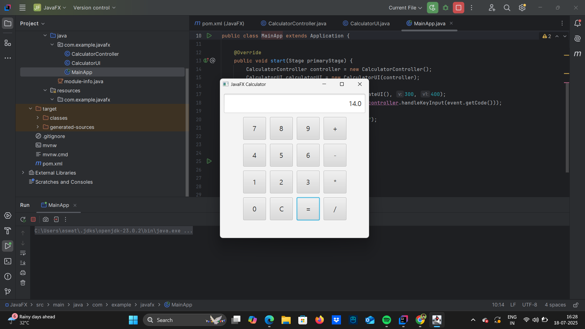

# Task 2 – JavaFX Calculator

A **simple calculator** application built using **JavaFX**.

---

## 💻 Technologies Used

- **Java**
- **JavaFX**

---

## 📁 Project Structure

└── main/
├── CalculatorController.java
├── CalculatorUI.java
└── MainApp.java

---

## 📸 Sample UI

To display it in the README:

